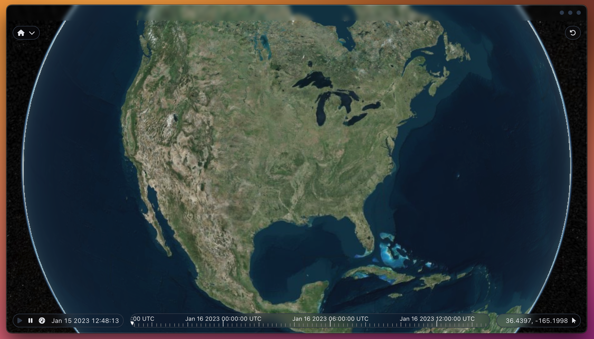

# Cesium Electron



This is just a project I'm playing with. I work in Cesium, Electron, Vue and Vite all the time and was looking for something simple to build that could be used for analytical purposes.

Currently, the application starts up, loads Cesium and can accept czml packets via http post at `localhost:3001/czml`

For more information on czml, see the [Cesium Sandcastle](https://sandcastle.cesium.com/) or the czml [documentation](https://github.com/AnalyticalGraphicsInc/czml-writer/wiki/CZML-Guide)

## Recommended IDE Setup

[VSCode](https://code.visualstudio.com/) + [Volar](https://marketplace.visualstudio.com/items?itemName=johnsoncodehk.volar) (and disable Vetur) + [TypeScript Vue Plugin (Volar)](https://marketplace.visualstudio.com/items?itemName=johnsoncodehk.vscode-typescript-vue-plugin).

## Type Support for `.vue` Imports in TS

TypeScript cannot handle type information for `.vue` imports by default, so we replace the `tsc` CLI with `vue-tsc` for type checking. In editors, we need [TypeScript Vue Plugin (Volar)](https://marketplace.visualstudio.com/items?itemName=johnsoncodehk.vscode-typescript-vue-plugin) to make the TypeScript language service aware of `.vue` types.

If the standalone TypeScript plugin doesn't feel fast enough to you, Volar has also implemented a [Take Over Mode](https://github.com/johnsoncodehk/volar/discussions/471#discussioncomment-1361669) that is more performant. You can enable it by the following steps:

1. Disable the built-in TypeScript Extension
   1. Run `Extensions: Show Built-in Extensions` from VSCode's command palette
   2. Find `TypeScript and JavaScript Language Features`, right click and select `Disable (Workspace)`
2. Reload the VSCode window by running `Developer: Reload Window` from the command palette.

## Customize configuration

See [Vite Configuration Reference](https://vitejs.dev/config/).

## Project Setup

```sh
# Requires nodejs, installs all modules required to run the application
npm install
```

### Compile and Hot-Reload for Development

```sh
# Starts the Vite dev server
npm run dev

# In another tab/window, to start the electon application
npm start
```

### Type-Check, Compile and Minify for Production

```sh
# Builds the ui
npm run build
```

### Create a compiled application

```sh
# Build the Vue ui
npm run build

# Compile the application using electron-packer
npm run release:win
```

### Run Unit Tests with [Vitest](https://vitest.dev/)

```sh
npm run test:unit
```

### Run End-to-End Tests with [Cypress](https://www.cypress.io/)

```sh
npm run build
npm run test:e2e # or `npm run test:e2e:ci` for headless testing
```

### Lint with [ESLint](https://eslint.org/)

```sh
npm run lint
```

## Changes

### 5/3/2022

- Replaced WindiCSS with Tailwind
- Add FontAwesome and replace several icons with FontAwesome variants

### 4/22/2022

- Added application screenshot

### 4/17/2022

- Work in progress: working on adding basic dropdown menu for menu bar
- Added current time display beside play/pause buttons
- Moved play/pause to toolbar in th ebottom left
- Added the ability to set the playback speed
- Added ability to padd custom values to the menu options
- Added ability to right click and remove entities
- Adjusted some tooltips and put their hotkey accelerator on them

### 4/7/2022

- Added tranlucent header and removed the window frame
- Added window controls to the header and the ipc methods behind them
- Removed all the default Cesium buttons in the top right
- Set a new default view for Cesium
- Added new custom home button that will reset the globe back to the default view
- Removed the default animation controller (that thing is ugly)
- Added a new toolbar in the bottom left to toggle play/pause state within Cesium
- Added toolbar to the bottom right to show the current mouse location in lat/lon decimal degrees
- Tweaked styling of the timeline bar. Changed the background color and made it a little translucent
- Added windi css for quicker/easier styling
- Added a little more documentation to the readme

## Things to add

- Ability to command the camera and other controls via the http interface
- Custom controls for switching to the default base layers from Cesium
- Cleanup the build process and trim as much unnecessary stuff as possible from the release output
- Typescript for the Electron main process and supporting modules
- Finish implementation of dropdown component for menus
- Add panel to show information about entities
- TypeScript definition for a czml packet. 🙄
